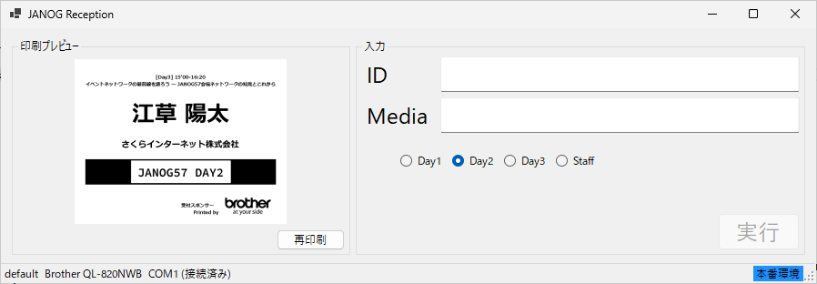
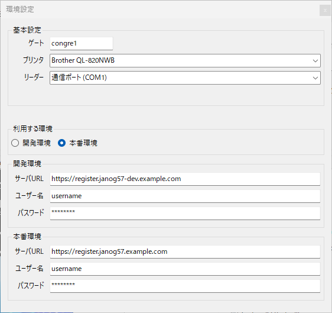

# janog-reception-ui

JANOG57 の現地受付業務のために、さくらインターネットが開発した Windows アプリケーションです。
別途稼働している参加登録システムと連携し、QRコードリーダーとブラザー社のラベルプリンターを利用して「参加者の受付（来場処理）」と「名札ラベル印刷」を行います。

実行ファイルも含め、複数コピーを作成することで一台のPCで複数のQRコードとラベルプリンターを制御することができます。



## 主な機能

- 参加者QR（URL文字列）から参加者ID（ULID）等を抽出
- 参加登録システム API へ受付情報を送信
- 参加者情報（氏名・所属・参加区分等）をラベルテンプレートへ反映
- ブラザー ラベルプリンターへ印刷
- 日別/スタッフ表示の切り替え（ラベル上の画像差し替え）

## 動作環境

- Windows 11
- Visual Studio 2026 / .NET 8 SDK（開発・ビルド時）
- ブラザー b-PAC SDK（COM コンポーネント `bpac` を使用）
- ブラザー製ラベルプリンター（b-PAC 対応機種）
- QRコードリーダー
	- 本アプリはシリアルポート（COM）入力を想定しています（`115200bps`）。
	- 端末/接続方式により、OS側で COM ポートとして見える必要があります。

## リポジトリ構成（抜粋）

- `ReceptionForm.cs` : 受付UI、シリアル入力の受信、API呼び出し、印刷処理
- `Client.cs` : 参加登録システム API クライアント（Basic認証）
- `Config.cs` : `config.yaml` の読み書き
- `label.lbx` : ラベルテンプレート（b-PAC）
- `day1.png`, `day2.png`, `day3.png`, `staff.png` : ラベル用画像

## セットアップ

### 1) 依存ソフト/ドライバの準備

1. ブラザー製プリンタードライバーをインストール
2. b-PAC SDK をインストール（`bpac` COM が登録され、コンパイル時に利用できること）
3. QRコードリーダーを接続し、Windows 上で COM ポートとして認識されることを確認

### 2) ビルド

Visual Studio 2026（Windows）で `janog-reception-ui.sln` を開いてビルドしてください。


### 3) 初回起動と設定ファイル

初回起動時、実行ファイルと同じフォルダに `config.yaml` が自動生成されます。
以後は、アプリ内の設定画面で編集して保存できます（または直接 `config.yaml` を編集）。


## 設定（config.yaml）

`config.yaml` は以下の項目を持ちます（名称はアプリ実装に準拠）。

設定変更はUIから行うことができます。

```yaml
environment:
	environment: develop # develop | production
	develop:
		base_url: "https://dev.example.com"
		username: "username"
		password: "password"
	production:
		base_url: "https://prod.example.com"
		username: "username"
		password: "password"

gate: "default"          # 受付ゲート名（APIに送信）
printer: ""              # 使用するプリンター名（Windowsのプリンター一覧の表示名）
reader:
	port: "COM3"           # QRリーダーのCOMポート
	serial: ""             # 現状は未使用
```

### 設定画面（アプリ内）



設定画面では以下を指定します。

- 環境（Develop / Production）
- ゲート名（Gate）
- プリンター（b-PAC 対応のプリンターのみが候補に表示されます）
- リーダー（COMポート。PnP 名称付きで表示される場合があります）
- API 接続情報（Base URL / Username / Password）

## 使い方（運用フロー）

1. アプリを起動
2. 右クリックで表示されるメニューから開く設定画面で ゲート情報 / プリンタ / QRリーダー / API 認証情報を設定
3. 会期（日別）を選択（Day1/Day2/Day3 など）
4. QRコードを読み取ると自動で受付情報を送信し、参加者情報をラベルに反映して印刷します

補足：参加者区分が `staff` または `host` の場合、ラベル画像をスタッフ用に切り替えて印刷します。

## 参加登録システム連携（概要）

- 認証：Basic 認証
- API：`POST /api/v1/participants/{id}/accept/`
- 送信：`gate` / `method`（QRの `?` より前の文字列が入ります）/ 参加者ID
- 受信：参加者情報（氏名、所属、区分、登壇プログラム等）

## ラベルテンプレート

印刷は `label.lbx`（b-PAC テンプレート）を使用します。
テンプレート内で利用している主なフィールド名：

- `program`
- `full_name`
- `organization`
- `day_image`

テンプレートを変更する場合は、上記フィールド名を維持するか、アプリ側の実装も合わせて変更してください。

## セキュリティ / 個人情報の取り扱いにおける注意点

- 本ソフトウェアは参加者の氏名・所属などの個人情報を扱います。取り扱いはイベントの運用規程に従ってください。
- `config.yaml` には API の認証情報（ユーザー名・パスワード）が保存されます。
	- 公開リポジトリへコミットしないでください。
	- 配布時は適切なアクセス権（ファイル権限/端末管理）を設定してください。
- 本ソフトウェアは外部APIへ通信します。会場ネットワーク/端末のセキュリティ要件に従って運用してください。

## ライセンス

MITライセンス
